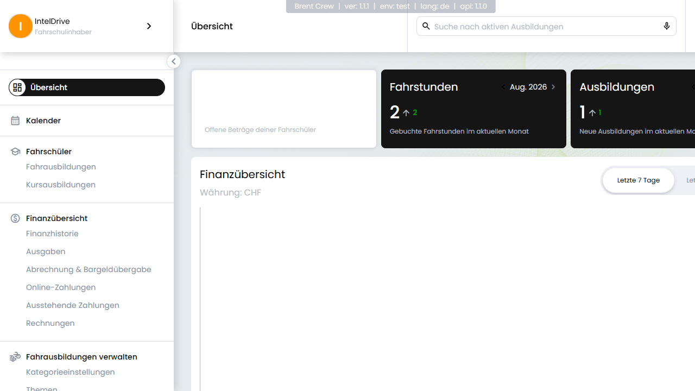
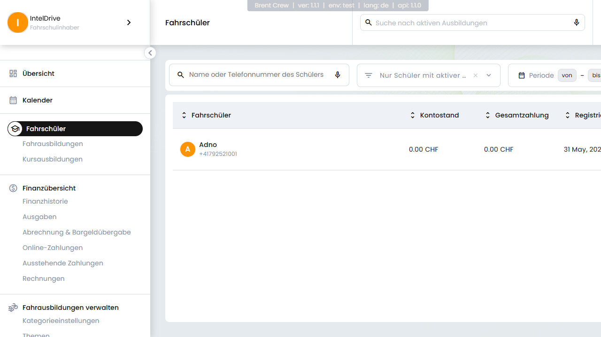
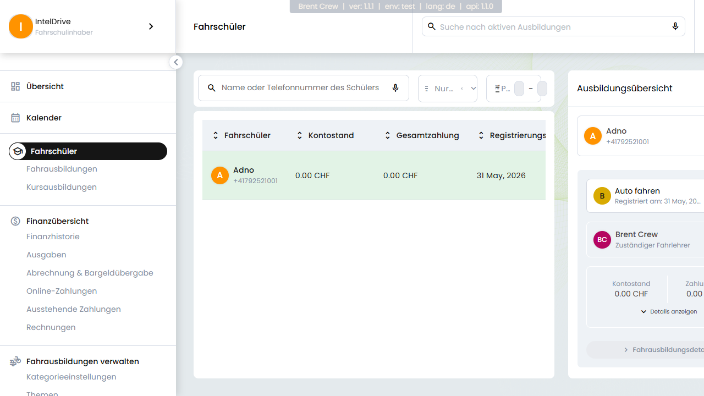
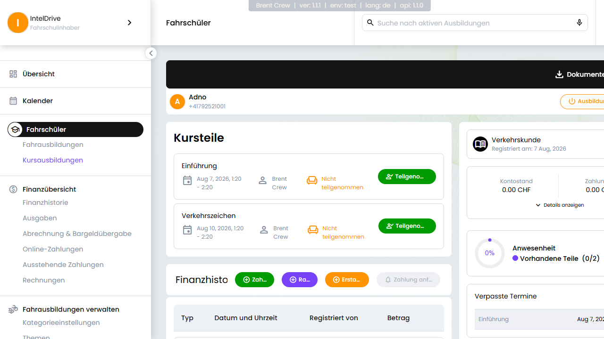
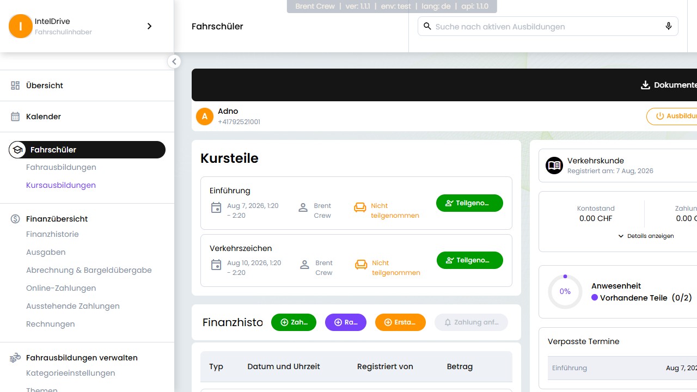

# Anwesenheit eines Kurses für einen Schüler anzeigen

Als **Fahrschulmanager** kannst du die Kursanwesenheit jeder Schülerin / jedes Schülers
bequem einsehen und, falls nötig, korrigieren. Diese Anleitung führt dich Schritt für Schritt
durch den Ablauf.

---

## Schritt 1 – Anmelden

Melde dich an der Admin-Plattform an. Du landest auf deiner **Übersicht** (Dashboard).

---

## Schritt 2 – Fahrschüler öffnen

Öffne im seitlichen Menü den Bereich **Schüler**. Es erscheint eine Liste aller Fahrschüler,
mit Details wie Kontostand und Registrierungsdatum.

---

## Schritt 3 – Schüler auswählen

Klicke in der Tabelle auf die Zeile des gewünschten Fahrschülers. An der rechten Seite
öffnet sich die **Ausbildungsübersicht** dieses Schülers. Dort siehst du seine
**Kursausbildungen**.

---

## Schritt 4 – Kursdetails öffnen

Klicke bei der gewünschten Kursausbildung auf die Schaltfläche **„Zu den Kursdetails“**.

---

## Schritt 5 – Anwesenheit prüfen

Auf der Kursdetailseite findest du die **Anwesenheit** der Schüler:

- Ein **Fortschrittsdiagramm**, das anzeigt, wie viele **Kursteile** der Schüler bereits
  absolviert hat (z. B. 3 von 5 vorhandenen Teilen).
- Den Bereich **„Verpasste Termine“** mit allen versäumten Einheiten – inklusive Teiltitel,
  Datum und verantwortlichem Ausbilder.
- Eine **Liste aller Kursteile**, aus der hervorgeht, welche Teile der Schüler besucht und
  welche verpasst hat.

---

Möchtest du einen Eintrag **korrigieren**, klicke auf den Anwesenheits-Schalter neben dem
jeweiligen Kursteil, um ihn als anwesend oder abwesend zu markieren. Die Änderung wird
sofort gespeichert.